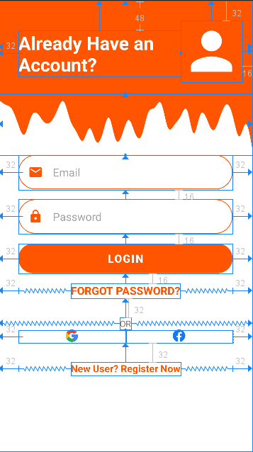
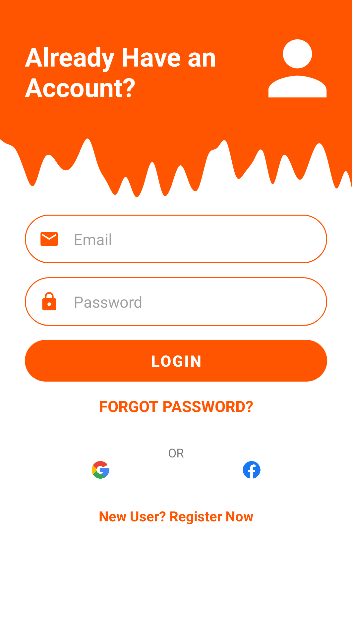
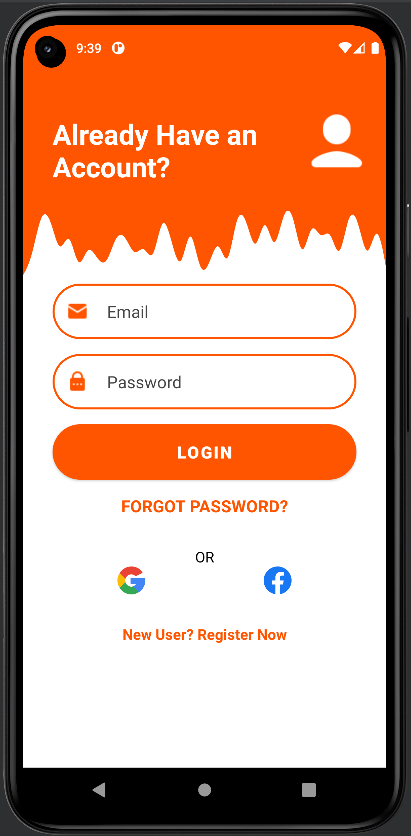
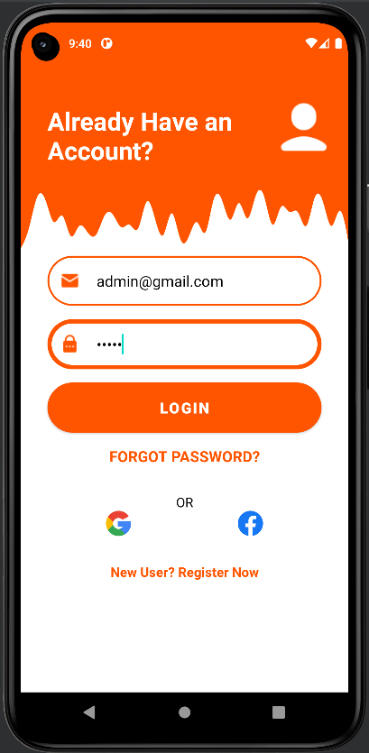
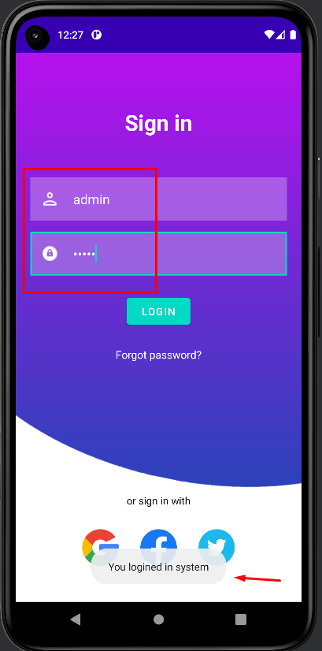

<p align = "center">МИНИСТЕРСТВО НАУКИ И ВЫСШЕГО ОБРАЗОВАНИЯ
РОССИЙСКОЙ ФЕДЕРАЦИИ
ФЕДЕРАЛЬНОЕ ГОСУДАРСТВЕННОЕ БЮДЖЕТНОЕ
ОБРАЗОВАТЕЛЬНОЕ УЧРЕЖДЕНИЕ ВЫСШЕГО ОБРАЗОВАНИЯ
«САХАЛИНСКИЙ ГОСУДАРСТВЕННЫЙ УНИВЕРСИТЕТ»</p>
<br><br><br><br><br><br>
<p align = "center">Институт естественных наук и техносферной безопасности<br>Кафедра информатики<br>Хроменков Владимир Александрович</p>
<br><br><br>

<p align = "center">Лабораторная работа №7<br>«Макет»<br>01.03.02 Прикладная математика и информатика</p>
<br><br><br><br><br><br><br><br><br><br><br><br>
<p align = "right">Научный руководитель<br>
Соболев Евгений Игоревич</p>
<br><br><br>
<p align = "center">г. Южно-Сахалинск<br>2023 г.</p>

***
# <p align = "center">Оглавление</p>
- [Цели и задачи](#цели-и-задачи)
- [Решение задач](#решение-задач)
    - [Упражнение. Сделать функциональный макет](#ui)
- [Вывод](#вывод)

***

# <p align = "center">Цели и задачи</p>

1.  Необходимо реализовать макет по изображению использую материалы из архива lab7.zip, соблюдая отступы согласно рисунку 1. 
<p align = "center">
    
    Рисунок 1 – Прототип макета
    
    Рисунок 2 – Финальный макет
</p>
Реализовать простую авторизацию по логину паролю, при удачной попытке вывести пользователю сообщение об авторизации, если пароль логин неверный, то сообщение об ошибке. 

***

# <p align = "center">Решение задач</p>

## <p align = "center">Макет и проверка правильности ввода</p>

С помощью`XML` сделал раметку окна для входа.

```xml
<?xml version="1.0" encoding="utf-8"?>
<LinearLayout xmlns:android="http://schemas.android.com/apk/res/android"
    xmlns:app="http://schemas.android.com/apk/res-auto"
    xmlns:tools="http://schemas.android.com/tools"
    android:layout_width="match_parent"
    android:layout_height="match_parent"
    android:background="@drawable/background"
    android:orientation="vertical"
    tools:context=".MainActivity">

    <LinearLayout
        android:layout_width="match_parent"
        android:layout_height="wrap_content"
        android:gravity="center"
        android:orientation="vertical"
        android:layout_marginTop="60dp">

        <TextView
            android:id="@+id/login_title"
            android:layout_width="wrap_content"
            android:layout_height="wrap_content"
            android:layout_marginTop="10dp"
            android:paddingHorizontal="100dp"
            android:paddingVertical="5dp"
            android:text="@string/login_title"
            android:textColor="@color/white"
            android:textSize="30dp"
            android:textStyle="bold"/>

        <EditText
            android:id="@+id/username"
            android:layout_width="match_parent"
            android:layout_height="60dp"
            android:layout_marginHorizontal="20dp"
            android:layout_marginTop="50dp"
            android:background="@drawable/custom_input"
            android:drawableStart="@drawable/user_icon"
            android:drawablePadding="20dp"
            android:ems="3"
            android:hint="@string/username_field"
            android:inputType="textPersonName"
            android:paddingStart="15dp"
            android:paddingEnd="10dp"
            android:textColor="@color/white"
            android:textColorHint="@color/gray"
            android:textSize="18sp" />

        <EditText
            android:id="@+id/password"
            android:layout_width="match_parent"
            android:layout_height="60dp"
            android:layout_marginHorizontal="20dp"
            android:layout_marginTop="15dp"
            android:background="@drawable/custom_input"
            android:drawableStart="@drawable/password_icon"
            android:drawablePadding="20dp"
            android:ems="3"
            android:hint="@string/password_field"
            android:inputType="textPassword"
            android:paddingStart="15dp"
            android:paddingEnd="10dp"
            android:textColor="@color/white"
            android:textColorHint="@color/gray"
            android:textSize="18sp" />

        <Button
            android:id="@+id/login_button"
            android:layout_width="wrap_content"
            android:layout_height="wrap_content"
            android:layout_marginTop="25dp"
            android:baselineAligned="false"
            android:text="@string/login_button" />

        <TextView
            android:id="@+id/forgot_password"
            android:layout_width="wrap_content"
            android:layout_height="wrap_content"
            android:layout_marginTop="20dp"
            android:paddingVertical="5dp"
            android:text="@string/forgot_password"
            android:textColor="@color/white"
            android:textSize="15dp" />

        <TextView
            android:id="@+id/or_sign_in"
            android:layout_width="wrap_content"
            android:layout_height="wrap_content"
            android:paddingVertical="5dp"
            android:text="@string/or_sign_in"
            android:textColor="@color/black"
            android:textSize="14dp"
            android:layout_marginTop="170dp"/>

        <LinearLayout
            android:layout_width="match_parent"
            android:layout_height="100dp"
            android:gravity="center"
            android:orientation="horizontal">

            <ImageButton
                android:id="@+id/login_google"
                android:layout_width="50dp"
                android:layout_height="50dp"
                android:layout_gravity="center_vertical"
                android:background="@color/white"
                android:src="@drawable/google"
                android:scaleType="fitCenter"
                android:layout_margin="15dp"/>
            <ImageButton
                android:id="@+id/login_facebook"
                android:layout_width="50dp"
                android:layout_height="50dp"
                android:layout_gravity="center_vertical"
                android:background="@color/white"
                android:src="@drawable/fb"
                android:scaleType="fitCenter"
                android:layout_margin="15dp"/>
            <ImageButton
                android:id="@+id/login_twitter"
                android:layout_width="50dp"
                android:layout_height="50dp"
                android:layout_gravity="center_vertical"
                android:background="@color/white"
                android:src="@drawable/twitter"
                android:scaleType="fitCenter"
                android:layout_margin="15dp"/>

        </LinearLayout>

    </LinearLayout>


</LinearLayout>
```

<p align = "center">
    
</p>

Далее добавил функционал для кнопки `LOGIN` и `FORGOT PASSWORD`

```kotlin
package com.zfginc.simplesignin

import androidx.appcompat.app.AppCompatActivity
import android.os.Bundle
import android.widget.Button
import android.widget.EditText
import android.widget.ImageButton
import android.widget.TextView
import android.widget.Toast

private const val USERNAME = "admin"
private const val PASSWORD = "admin"

class MainActivity : AppCompatActivity() {

    private lateinit var login_button: Button;

    private lateinit var login_google: ImageButton;
    private lateinit var login_facebook: ImageButton;
    private lateinit var login_twitter: ImageButton;

    private lateinit var fogot_password: TextView;

    private lateinit var username_input: EditText;
    private lateinit var password_input: EditText;

    override fun onCreate(savedInstanceState: Bundle?) {
        super.onCreate(savedInstanceState)
        setContentView(R.layout.activity_main)

        login_button = findViewById(R.id.login_button);
        login_google = findViewById(R.id.login_google);
        login_facebook = findViewById(R.id.login_facebook);
        login_twitter = findViewById(R.id.login_twitter);
        fogot_password = findViewById(R.id.forgot_password);
        username_input = findViewById(R.id.username);
        password_input = findViewById(R.id.password);

        login_button.setOnClickListener(){
            login();
        }

        fogot_password.setOnClickListener(){
            showToast("usr/pas - admin/admin")
        }
    }

    private fun showToast(id: Int){
        Toast.makeText(this, id, Toast.LENGTH_SHORT).show()
    }
    private fun showToast(text: String){
        Toast.makeText(this, text, Toast.LENGTH_LONG).show()
    }

    private fun login(){
        var username = username_input.getText().toString()
        var password = password_input.getText().toString()

        if(username == "" || password == "") {
            showToast(R.string.none_field)
            return
        }

        if(username == USERNAME && password == PASSWORD)
            showToast(R.string.correct_login)
        else
            showToast(R.string.uncorrect_login)
    }
}
```

<p align = "center">
    
    
</p>


***

# <p align = "center">Вывод</p>

Выполнив *лабораторную работу №7*, совершенствую навыки работы со средой разработки `Android Studion`, верстки дизайда приложения с помощью `XML` и работы с языком `Kotlin`. 