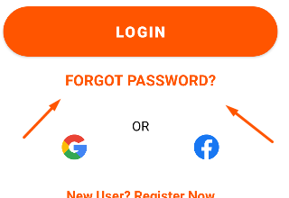
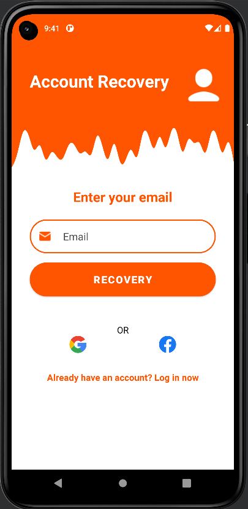
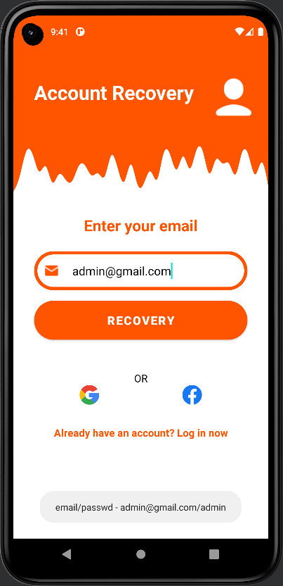

<p align = "center">МИНИСТЕРСТВО НАУКИ И ВЫСШЕГО ОБРАЗОВАНИЯ
РОССИЙСКОЙ ФЕДЕРАЦИИ
ФЕДЕРАЛЬНОЕ ГОСУДАРСТВЕННОЕ БЮДЖЕТНОЕ
ОБРАЗОВАТЕЛЬНОЕ УЧРЕЖДЕНИЕ ВЫСШЕГО ОБРАЗОВАНИЯ
«САХАЛИНСКИЙ ГОСУДАРСТВЕННЫЙ УНИВЕРСИТЕТ»</p>
<br><br><br><br><br><br>
<p align = "center">Институт естественных наук и техносферной безопасности<br>Кафедра информатики<br>Хроменков Владимир Александрович</p>
<br><br><br>

<p align = "center">Лабораторная работа №9<br>«Макет»<br>01.03.02 Прикладная математика и информатика</p>
<br><br><br><br><br><br><br><br><br><br><br><br>
<p align = "right">Научный руководитель<br>
Соболев Евгений Игоревич</p>
<br><br><br>
<p align = "center">г. Южно-Сахалинск<br>2023 г.</p>

***
# <p align = "center">Оглавление</p>
- [Цели и задачи](#цели-и-задачи)
- [Решение задач](#решение-задач)
    - [Упражнение. Сделать функциональный макет](#ui)
- [Вывод](#вывод)

***

# <p align = "center">Цели и задачи</p>

1.  Необходимо реализовать макет по изображению, соблюдая отступы согласно рисунку 1.  
<p align = "center">
    
    <br>
    Рисунок 1 – Прототип макета
    <br>
    
    <br>
    Рисунок 2 – Финальный макет
</p>
Реализовать простую авторизацию по логину паролю, при удачной попытке вывести пользователю сообщение об авторизации, если пароль логин неверный, то сообщение об ошибке.  

Сделать вторую Activity для восстановления пароля в стилистике рисунка 1, также сделать переход с главной Activity на вторую.

***

# <p align = "center">Решение задач</p>

## <p align = "center">Макет и проверка правильности ввода</p>

С помощью`XML` сделал раметку окна для входа.

```xml
<?xml version="1.0" encoding="utf-8"?>
<LinearLayout xmlns:android="http://schemas.android.com/apk/res/android"
    xmlns:app="http://schemas.android.com/apk/res-auto"
    xmlns:tools="http://schemas.android.com/tools"
    android:layout_width="match_parent"
    android:layout_height="match_parent"
    android:orientation="vertical"
    android:background="@color/white"
    tools:context=".MainActivity">

    <LinearLayout
        android:layout_width="match_parent"
        android:layout_height="140dp"
        android:baselineAligned="false"
        android:orientation="horizontal"
        android:gravity="center_horizontal"
        android:background="@color/orange">

        <TextView
            android:id="@+id/title"
            android:layout_width="270dp"
            android:layout_height="wrap_content"
            android:layout_marginLeft="32dp"
            android:layout_marginTop="48dp"
            android:text="@string/title_login"
            android:textColor="@color/white"
            android:textSize="30dp"
            android:textStyle="bold"/>

        <ImageView
            android:id="@+id/user_icon"
            android:layout_width="wrap_content"
            android:layout_height="wrap_content"
            android:layout_marginTop="32dp"
            android:layout_marginRight="16dp"
            app:srcCompat="@drawable/user_icon" />

    </LinearLayout>

    <ImageView
        android:id="@+id/wave"
        android:layout_width="match_parent"
        android:layout_height="90dp"
        app:srcCompat="@drawable/wave"
        android:scaleType="fitXY"/>

    <EditText
        android:id="@+id/email"
        android:layout_width="match_parent"
        android:layout_height="60dp"
        android:layout_marginHorizontal="32dp"
        android:autofillHints="emailAddress"
        android:background="@drawable/custom_input"
        android:drawableStart="@drawable/email_icon"
        android:drawablePadding="20dp"
        android:hint="@string/email_field"
        android:inputType="textEmailAddress"
        android:paddingStart="15dp"
        android:paddingEnd="10dp"
        android:textColor="@color/black"
        android:textColorHint="@color/gray"
        android:textSize="18sp" />

    <EditText
        android:id="@+id/password"
        android:layout_width="match_parent"
        android:layout_height="60dp"
        android:layout_marginHorizontal="32dp"
        android:layout_marginTop="16dp"
        android:autofillHints="password"
        android:background="@drawable/custom_input"
        android:drawableStart="@drawable/password_icon"
        android:drawablePadding="20dp"
        android:hint="@string/password_field"
        android:inputType="textPassword"
        android:paddingStart="15dp"
        android:paddingEnd="10dp"
        android:textColor="@color/black"
        android:textColorHint="@color/gray"
        android:textSize="18sp" />

    <Button
        android:id="@+id/login_button"
        android:layout_width="match_parent"
        android:layout_height="60dp"
        android:layout_marginHorizontal="32dp"
        android:layout_marginTop="16dp"
        android:background="@drawable/custom_input"
        android:baselineAligned="false"
        android:text="@string/login_button"
        android:textSize="18sp"
        android:textStyle="bold"/>

    <TextView
        android:id="@+id/forgot_password"
        android:layout_width="match_parent"
        android:layout_height="wrap_content"
        android:layout_marginTop="16dp"
        android:layout_marginHorizontal="32dp"
        android:text="@string/forgot_password"
        android:textColor="@color/orange"
        android:textSize="18dp"
        android:textAlignment="center"
        android:textStyle="bold"/>

    <TextView
        android:id="@+id/or_sign_in"
        android:layout_width="match_parent"
        android:layout_height="wrap_content"
        android:layout_marginTop="32dp"
        android:layout_marginHorizontal="32dp"
        android:text="@string/or_sign_in"
        android:textColor="@color/black"
        android:textSize="16sp"
        android:textAlignment="center"/>

    <LinearLayout
        android:layout_width="match_parent"
        android:layout_height="30dp"
        android:gravity="center|bottom"
        android:orientation="horizontal">

        <ImageButton
            android:id="@+id/login_google"
            android:layout_width="30dp"
            android:layout_height="30dp"
            android:layout_gravity="center_vertical"
            android:layout_marginRight="64dp"
            android:background="@color/white"
            android:scaleType="fitCenter"
            android:src="@drawable/google" />

        <ImageButton
            android:id="@+id/login_facebook"
            android:layout_width="30dp"
            android:layout_height="30dp"
            android:layout_gravity="center_vertical"
            android:layout_marginLeft="64dp"
            android:background="@color/white"
            android:scaleType="fitCenter"
            android:src="@drawable/fb" />
    </LinearLayout>

    <TextView
        android:id="@+id/new_user"
        android:layout_width="match_parent"
        android:layout_height="wrap_content"
        android:layout_marginTop="32dp"
        android:layout_marginHorizontal="32dp"
        android:text="@string/new_user"
        android:textColor="@color/orange"
        android:textSize="16dp"
        android:textAlignment="center"
        android:textStyle="bold"/>

</LinearLayout>
```

<p align = "center">
    
    <br>
    
</p>

Далее добавил функционал для кнопки `LOGIN` и `FORGOT PASSWORD`

```kotlin
package com.zfginc.simplesignin

import android.content.Intent
import android.os.Bundle
import android.util.Patterns
import android.widget.*
import androidx.appcompat.app.AppCompatActivity


private const val EMAIL = "admin@gmail.com"
private const val PASSWORD = "admin"

class MainActivity : AppCompatActivity() {

    private lateinit var login_button: Button;
    private lateinit var fogot_password: TextView;

    private lateinit var email_input: EditText;
    private lateinit var password_input: EditText;

    override fun onCreate(savedInstanceState: Bundle?) {
        super.onCreate(savedInstanceState)
        setContentView(R.layout.activity_main)

        login_button = findViewById(R.id.login_button);
        fogot_password = findViewById(R.id.forgot_password);
        email_input = findViewById(R.id.email);
        password_input = findViewById(R.id.password);

        login_button.setOnClickListener(){
            login();
        }

        fogot_password.setOnClickListener(){
            startActivity(Intent(this@MainActivity, Recovery::class.java))
        }

    }

    private fun showToast(id: Int){
        Toast.makeText(this, id, Toast.LENGTH_SHORT).show()
    }
    private fun showToast(text: String){
        Toast.makeText(this, text, Toast.LENGTH_LONG).show()
    }

    private fun login(){
        var email = email_input.getText().toString()
        var password = password_input.getText().toString()

        if(email == "" || password == "") {
            showToast(R.string.none_field)
            return
        }

        if(!isEmailValid(email)){
            showToast(R.string.email_not_valid)
            return
        }

        if(email == EMAIL && password == PASSWORD)
            showToast(R.string.correct_login)
        else
            showToast(R.string.uncorrect_login)
    }

    private fun isEmailValid(email: String?): Boolean {
        return Patterns.EMAIL_ADDRESS.matcher(email).matches()
    }
}
```

Сделал вторую `Activity` *Recovery* для восстановления доступа к аккаунту и переход к ней.

<p align = "center">
    
    <br>
    
</p>

```xml
<?xml version="1.0" encoding="utf-8"?>
<LinearLayout xmlns:android="http://schemas.android.com/apk/res/android"
    xmlns:app="http://schemas.android.com/apk/res-auto"
    xmlns:tools="http://schemas.android.com/tools"
    android:layout_width="match_parent"
    android:layout_height="match_parent"
    android:orientation="vertical"
    android:background="@color/white"
    tools:context=".Recovery">

    <LinearLayout
        android:layout_width="match_parent"
        android:layout_height="140dp"
        android:baselineAligned="false"
        android:orientation="horizontal"
        android:gravity="center_horizontal"
        android:background="@color/orange">

        <TextView
            android:id="@+id/title"
            android:layout_width="270dp"
            android:layout_height="wrap_content"
            android:layout_marginLeft="32dp"
            android:layout_marginTop="48dp"
            android:text="@string/title_recovery"
            android:textColor="@color/white"
            android:textSize="30dp"
            android:textStyle="bold"/>

        <ImageView
            android:id="@+id/user_icon"
            android:layout_width="wrap_content"
            android:layout_height="wrap_content"
            android:layout_marginTop="32dp"
            android:layout_marginRight="16dp"
            app:srcCompat="@drawable/user_icon" />

    </LinearLayout>

    <ImageView
        android:id="@+id/wave"
        android:layout_width="match_parent"
        android:layout_height="90dp"
        app:srcCompat="@drawable/wave"
        android:scaleType="fitXY"/>

    <TextView
        android:id="@+id/enter_mail"
        android:layout_width="match_parent"
        android:layout_height="40dp"
        android:layout_marginTop="26dp"
        android:layout_marginHorizontal="32dp"
        android:text="@string/enter_mail"
        android:textColor="@color/orange"
        android:textSize="24sp"
        android:textAlignment="center"
        android:textStyle="bold"/>

    <EditText
        android:id="@+id/email"
        android:layout_width="match_parent"
        android:layout_height="60dp"
        android:layout_marginHorizontal="32dp"
        android:layout_marginTop="16dp"
        android:autofillHints="emailAddress"
        android:background="@drawable/custom_input"
        android:drawableStart="@drawable/email_icon"
        android:drawablePadding="20dp"
        android:hint="@string/email_field"
        android:inputType="textEmailAddress"
        android:paddingStart="15dp"
        android:paddingEnd="10dp"
        android:textColor="@color/black"
        android:textColorHint="@color/gray"
        android:textSize="18sp" />

    <Button
        android:id="@+id/recovery_button"
        android:layout_width="match_parent"
        android:layout_height="60dp"
        android:layout_marginHorizontal="32dp"
        android:layout_marginTop="16dp"
        android:background="@drawable/custom_input"
        android:baselineAligned="false"
        android:text="@string/recovery"
        android:textSize="18sp"
        android:textStyle="bold"/>

    <TextView
        android:id="@+id/or_sign_in"
        android:layout_width="match_parent"
        android:layout_height="wrap_content"
        android:layout_marginTop="48dp"
        android:layout_marginHorizontal="32dp"
        android:text="@string/or_sign_in"
        android:textColor="@color/black"
        android:textSize="16sp"
        android:textAlignment="center"/>

    <LinearLayout
        android:layout_width="match_parent"
        android:layout_height="30dp"
        android:gravity="center|bottom"
        android:orientation="horizontal">

        <ImageButton
            android:id="@+id/login_google"
            android:layout_width="30dp"
            android:layout_height="30dp"
            android:layout_gravity="center_vertical"
            android:layout_marginRight="64dp"
            android:background="@color/white"
            android:scaleType="fitCenter"
            android:src="@drawable/google" />

        <ImageButton
            android:id="@+id/login_facebook"
            android:layout_width="30dp"
            android:layout_height="30dp"
            android:layout_gravity="center_vertical"
            android:layout_marginLeft="64dp"
            android:background="@color/white"
            android:scaleType="fitCenter"
            android:src="@drawable/fb" />
    </LinearLayout>

    <TextView
        android:id="@+id/sign_in"
        android:layout_width="match_parent"
        android:layout_height="wrap_content"
        android:layout_marginTop="32dp"
        android:layout_marginHorizontal="32dp"
        android:text="@string/sign_in"
        android:textColor="@color/orange"
        android:textSize="16dp"
        android:textAlignment="center"
        android:textStyle="bold"/>

</LinearLayout>
```

```kotlin
package com.zfginc.simplesignin

import android.os.Bundle
import android.provider.ContactsContract.CommonDataKinds.Email
import android.util.Patterns
import android.widget.*
import androidx.appcompat.app.AppCompatActivity

private const val EMAIL = "admin@gmail.com"
private const val PASSWORD = "admin"

class Recovery : AppCompatActivity() {

    private lateinit var recovery_button: Button
    private lateinit var sign_in_text: TextView

    private lateinit var email_input: EditText


    override fun onCreate(savedInstanceState: Bundle?) {
        super.onCreate(savedInstanceState)
        setContentView(R.layout.activity_recovery)

        recovery_button = findViewById(R.id.recovery_button);
        email_input = findViewById(R.id.email);
        sign_in_text = findViewById(R.id.sign_in)

        recovery_button.setOnClickListener(){
            Recovery()

        }

        sign_in_text.setOnClickListener(){
            finish();
        }

    }

    private fun showToast(id: Int){
        Toast.makeText(this, id, Toast.LENGTH_SHORT).show()
    }
    private fun showToast(text: String){
        Toast.makeText(this, text, Toast.LENGTH_LONG).show()
    }

    private fun isEmailValid(email: String?): Boolean {
        return Patterns.EMAIL_ADDRESS.matcher(email).matches()
    }

    private fun Recovery(){
        var email = email_input.getText().toString()

        if(!isEmailValid(email)) {
            showToast(R.string.email_not_valid)
            return
        }

        if(email == EMAIL)
            showToast("Password: $PASSWORD")
        else
            showToast(R.string.not_found)
    }
}
```

<p align = "center">
    
</p>

***

# <p align = "center">Вывод</p>

Выполнив *лабораторную работу №9*, совершенствую навыки работы со средой разработки `Android Studion`, верстки дизайда приложения с помощью `XML` и работы с языком `Kotlin`. 
